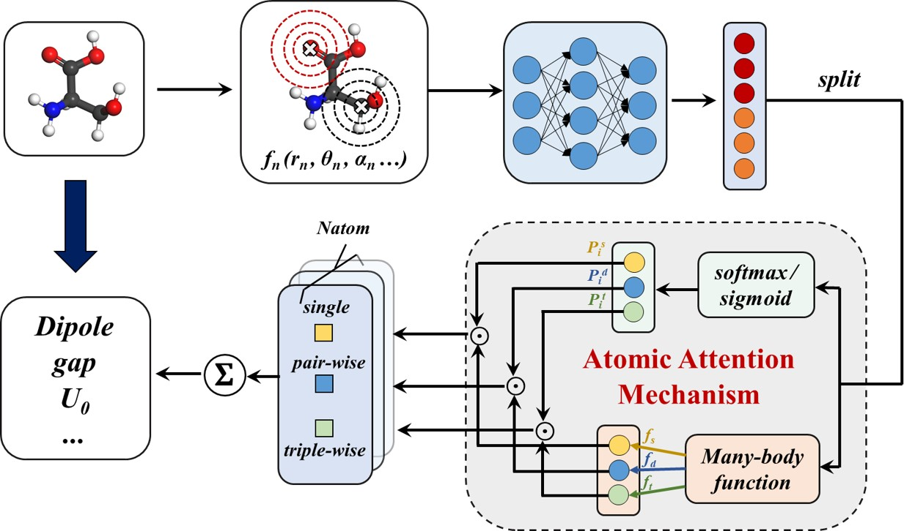

# MBNN-att-for-Predicting-Molecular-Properties

## Many-Body Function Neural Network with Atomic Attention Mechanism (MBNN-att) for Predicting Molecular Properties



## Introduction
This project includes a series of explicit function-type molecular structure descriptors, as well as corresponding neural networks for modeling molecular properties. The molecular structure descriptors include: MBTR, ACSF, SOAP, and PTSD. It also provides an example of MBNN-att for both extensive and intensive properties: ``` U0 ``` and ``` HOMO ```. The folder contains the corresponding LASP programs for training, specifically lasp-Exten and lasp-Inten.

For the global descriptor MBTR, each structure generates a corresponding structural descriptor, which is then processed using a single feed-forward neural network (NN).

For the local descriptors ACSF and SOAP, each atom in the structure generates its own atomic descriptor. Since different types of atoms should be distinguished, the project adopts the shared-weight neural network (shared-weight NN) proposed by Pearson et al. to process these atomic structural descriptors.

For the PTSD, the project implements the calculation of PTSD through the LASP program.

The project provides a comprehensive framework for predicting molecular properties using various molecular structure descriptors and neural network models, including the novel MBNN-att approach. This can be a valuable resource for researchers and practitioners working on molecular property prediction tasks.

## Requirements
1. Pytorch with version 2.0.0 (https://github.com/pytorch/pytorch)
2. Pytorch Geometric with version 2.3.1 (https://github.com/pyg-team/pytorch_geometric)
3. DScribe with version 2.0.1 (https://github.com/SINGROUP/dscribe)
4. LASP 3.4.0 (http://www.lasphub.com/#/lasp/download)

## Usage
1. First, compute the structural descriptors. Execute the ``` load_data.py ``` file corresponding to the property you want to predict. This will generate a data folder. In the process folder, a data_v3.pt file will be created, which contains the element symbols, 3D coordinates, structural descriptors, and the target molecular properties for the molecules.
2. After obtaining the processed data, you can run python ``` main.py ```. This will continuously output the loss for each step, as well as the MAE on the train and test sets. The program will print the "best" row, which represents the best result obtained during the current training.
3. If you want to use LASP for property prediction, you need to download LASP from http://www.lasphub.com/#/lasp/download, and then follow the file preparation in the U0 and HOMO folders to run LASP.

## Set up parameters
1. Cutoff: The cutoff value rcut in ``` load_data.py ```.
2. Number of hidden layers: The number of hidden layers num_layers in ``` main.py ```.
3. Batch size: The batch_size in ``` main.py ```.

## result
| Property | MBTR | ACSF | SOAP | PTSD | MBNN-att |
|:------|:-------------:|:-------------:|:----------------:|:----------------:|:----------------:|
| μ | 0.293 |	0.065	| 0.182	| 0.094 | 0.021 |
| α | 0.203 |	0.171 |	0.209 |	0.093 |	0.066 |
| εHOMO | 79.5 | 68.2 |	83.7 |	54.2 |	35.1 |
| εLUMO | 71.8 |	72.5 |	75.8 |	51.5 |	29.5 |
| Δε | 107.4 |	103.3 |	114.8 |	76.9 |	47.7 |
| R2 | 2.9 |	3.5 |	5.8 |	1.32 |	0.093 |
| ZPVE | 4.20 |	2.00 |	2.74 |	1.79 |	1.16 |
| U0 | 49.09 |	22.83 |	25.38 |	10.91 |	5.33 |
| U | 48.90	| 22.85 |	25.05 |	11.44 |	5.34 |
| H | 48.91 |	23.51 |	24.86 |	11.58 |	5.32 |
| G | 49.68 |	23.02 |	24.84 |	11.72 |	5.32 |
| Cv | 0.070 |	0.070 |	0.063 |	0.033 |	0.024 |


